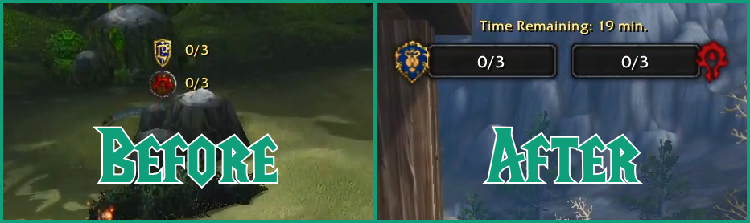

# BGObjectiveBars

Addon de barras de objetivo para campos de batalla en **World of Warcraft: Mists of Pandaria 5.4.8**. Reemplaza los indicadores numéricos de PVP (capturas de bandera / puntos de equipo) por barras al estilo del `WorldStateFrame`.

- Barra **izquierda** = Alianza
- Barra **derecha** = Horda

Porteado desde el parche custom `WorldStateFrame` de PandaWoW. Funciona con el cliente 5.4.x estándar usando la API estándar de 5.4 y las texturas del widget de objetivos incluidas (con fallback a colores sólidos si faltan).

## Campos de batalla soportados

- Garganta Grito de Guerra / Cumbres Gemelas (captura de bandera)
- Cuenca de Arathi / Batalla por Gilneas / Ojo de la Tormenta / Garganta Fondo Profundo / Mercado de Windvale (bases)
- Valle de Alterac / Isla de la Conquista (refuerzos)
- Templo de Kotmogu / Minas Lonjaplata / Costa Esquiva (objetos transportados)

## Instalación

1. Descargá el repo como ZIP y descomprimilo.
2. Renombrá la carpeta extraída de `BGObjectiveBars-main` a `BGObjectiveBars` (debe coincidir con el `.toc`, si no el addon no carga).
3. Copiá la carpeta `BGObjectiveBars` en `World of Warcraft/Interface/AddOns/`.
4. Reiniciá el cliente (o `/rl`) y asegurate de tener el addon activado.

## Requisitos

- Cliente MoP **5.4.8** (`## Interface: 50400`).

## Licencia

Código bajo licencia [MIT](LICENSE). Las texturas de `textures/` son assets de Blizzard Entertainment e se incluyen únicamente para el funcionamiento del addon.
