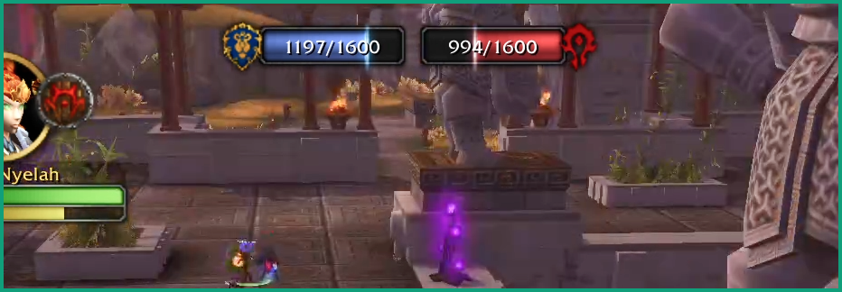
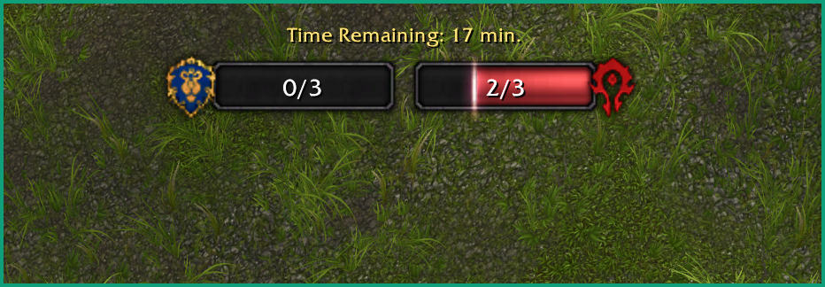
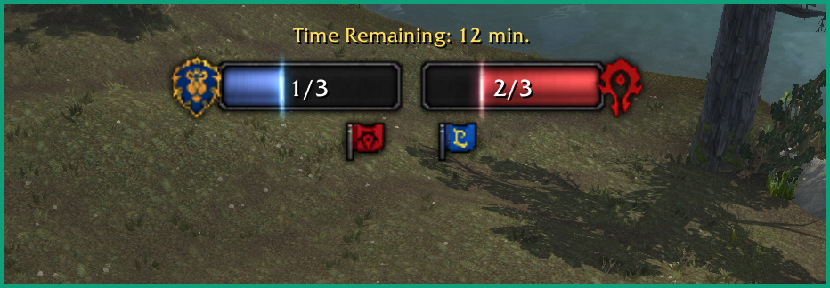

# BGObjectiveBars

Addon de barras de objetivo para campos de batalla en **World of Warcraft: Mists
of Pandaria 5.4.8** (`## Interface: 50400`). Reemplaza los indicadores numéricos
de PVP (capturas de bandera / puntos de equipo) por barras al estilo del
`WorldStateFrame`.

- Barra **izquierda** = Alianza
- Barra **derecha** = Horda

Cada barra muestra el progreso del objetivo del BG (capturas de bandera, puntos de
equipo, orbes, vagonetas, etc.) en formato `actual/máximo`, junto con iconos POI
sobre las bases.

Porteado desde el parche custom `WorldStateFrame` de PandaWoW. Funciona con el
cliente 5.4.x estándar usando la API estándar de 5.4 y las texturas del widget de
objetivos incluidas (con fallback a colores sólidos si faltan).


<details>
<summary>Ver más capturas</summary>







</details>

## Campos de batalla soportados

- Garganta Grito de Guerra / Cumbres Gemelas (captura de bandera)
- Cuenca de Arathi / Batalla por Gilneas / Ojo de la Tormenta / Garganta Fondo
  Profundo / Mercado de Windvale (bases)
- Valle de Alterac / Isla de la Conquista (refuerzos)
- Templo de Kotmogu / Minas Lonjaplata / Costa Esquiva (objetos transportados)

## Instalación

Este repositorio **contiene** al addon; la carpeta que carga el cliente es
`Interface/AddOns/BGObjectiveBars/`.

1. Descargá el repo como ZIP y descomprimilo.
2. Copiá la carpeta `BGObjectiveBars/` (la que está dentro del repo, ya tiene el
   nombre correcto) a `World of Warcraft/Interface/AddOns/`:

   ```powershell
   Copy-Item -Recurse -Force .\BGObjectiveBars "N:\Games\Mists of Pandaria\Interface\AddOns\BGObjectiveBars"
   ```

3. Reiniciá el cliente o la interfaz con `/rl`, y asegurate de tener el addon
   activado ("Load out of date addons" puede ser necesario según el cliente).

## Uso

- `/bgbars` — muestra u oculta las barras.

Las barras solo aparecen en los campos de batalla soportados.

## Cómo funciona

- Lee los world states del BG a través de la API custom de PandaWoW
  (`C_PandaWoWAPI.GetWorldState`), con fallback a `GetWorldState` /
  `GetWorldStateInfo`.
- Oculta los indicadores numéricos stock (`AlwaysUpFrame1..N`) mientras las barras
  están visibles.
- Los iconos POI se dibujan con atlases de texturas incluidos
  (`textures/*.blp`); si falta un atlas cae a colores sólidos.

## Estructura del repositorio

Este repositorio contiene al addon; no es la carpeta live que carga el cliente.
La fuente de verdad es `BGObjectiveBars/`.

```
BGObjectiveBars-MoP/
├── BGObjectiveBars/     # fuente del addon (se copia a Interface/AddOns/)
│   ├── BGObjectiveBars.lua
│   ├── BGObjectiveBars.toc
│   └── textures/
├── images/              # screenshots
├── AGENTS.md            # notas de desarrollo
├── CHANGELOG.md
├── LICENSE
└── README.md
```

## Requisitos

- Cliente MoP **5.4.8** (`## Interface: 50400`).

## Licencia

Código bajo licencia [MIT](LICENSE). Las texturas de `textures/` son assets de
Blizzard Entertainment y se incluyen únicamente para el funcionamiento del addon.
